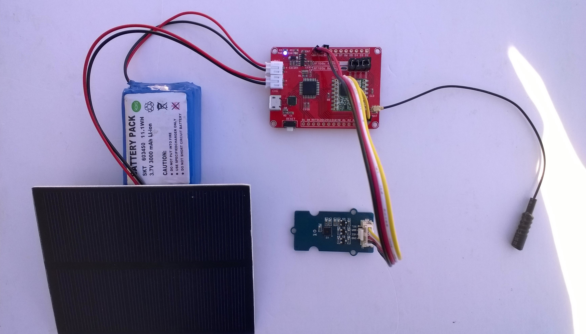

# FieldGateway.LoRa.MaduinoClient
Sample MakerFabs Maduinio client for my [LoRa](https://lora-alliance.org/) field gateway projects

My Maduino client uses
* [MakerFabs Maduino LoRa Redio 868MHz](https://makerfabs.com/index.php?route=product/product&product_id=438)
* [SeeedStudio Grove-Temperature & Humidity Sensor ](https://www.seeedstudio.com/Grove-Temperature%26Humidity-Sensor-%28High-Accuracy-%26-Mini%29-p-1921.html)
* [Seeedstudio Grove-4 pin Male Jumper to Grove 4 pin Conversion Cable](https://www.seeedstudio.com/Grove-4-pin-Male-Jumper-to-Grove-4-pin-Conversion-Cable-5-PCs-per-Pac-p-1565.html)
* [Elecrow 1W Solar Panel with Wires](https://www.elecrow.com/1w-solar-panel-with-wires-p-817.html)
* 3000mAh Battery

MakerFabs Maduino

There is also a [Maduino 433MHz](https://makerfabs.com/index.php?route=product/product&product_id=439)
